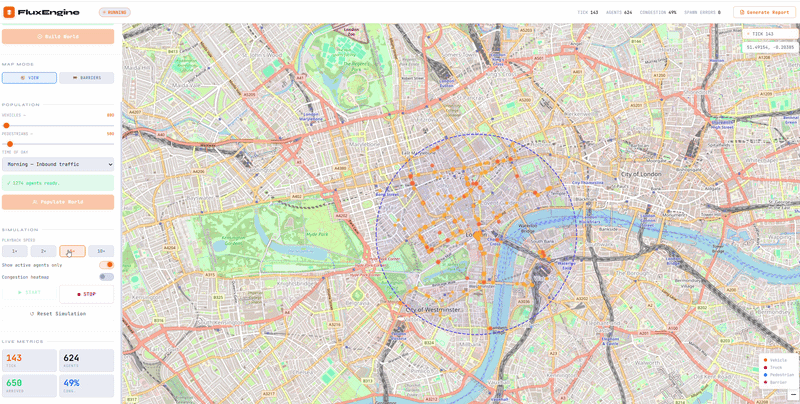
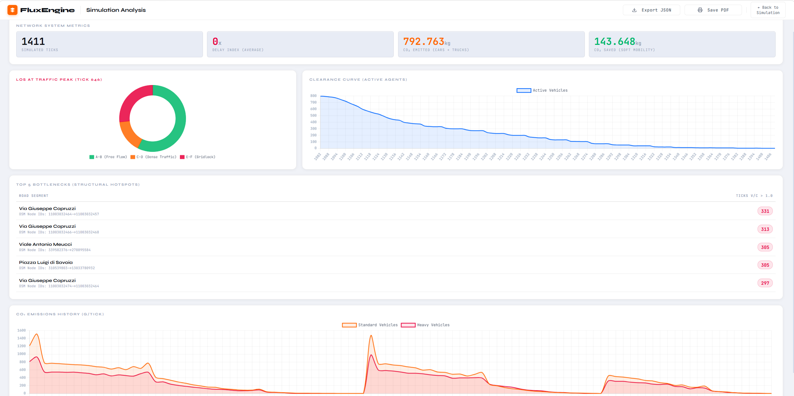

<h1 align="center">
   FluxEngine
</h1>
<h4 align="center">Large-Scale Urban Mobility Engine</h4>

  
  
  
  

  <i>A Data-Oriented urban traffic simulator built to model the structural impact of road networks on metropolitan-scale populations.</i>

 

## Goals of the Project

**FluxEngine** was conceived with a definitive purpose: to provide urban planners, civil engineers, and researchers with a rigorous, high-performance "what-if" testing environment for urban mobility.

The primary goal of the software is to enable the preemptive evaluation of structural modifications within a metropolitan grid. Whether simulating the deployment of a long-term construction site, a sudden arterial road closure due to an accident, or the pedestrianization of a historical district, FluxEngine calculates and visualizes how traffic flows—both vehicular and pedestrian—autonomously reorganize to bypass the obstacle. This allows professionals to anticipate network vulnerabilities and the emergence of macroscopic bottlenecks before any physical intervention occurs.

## Core Features 

The simulator provides a comprehensive, interactive web interface designed to control the entire lifecycle of the spatial analysis without requiring direct code manipulation.

### 1. Global Selection via Interactive Mapping
The engine is not constrained to pre-rendered scenarios. Powered by an integrated Nominatim search engine and *OpenStreetMap (OSMnx)* data, **users can generate a functional traffic ecosystem in any location worldwide**. By searching for a city, navigating the interactive map, and setting an action radius, the system instantly downloads and compiles the authentic vehicular and pedestrian topology of the selected quadrant.

  

### 2. Topological Modifications (Interactive Barriers)
This represents the core of the "what-if" analysis. By switching the interface to **Barriers Mode**, the user can click on any intersection or road segment on the map to deploy a Physical Barrier. 
This action topologically severs the road network: the simulation engine is forced to recalculate the shortest paths for thousands of agents in real time, allowing the operator to visually assess the immediate shifts in traffic distribution and the subsequent impact on secondary routes.

### 3. Live Rendering on OSM Cartography
The evolution of the traffic ecosystem is not limited to raw terminal output. The simultaneous movement of standard vehicles, heavy trucks, and pedestrians is rendered in **real-time directly over the OpenStreetMap cartography**, utilizing a high-performance Canvas overlay. This enables the visual tracking of gridlock formations and fleet reactivity, while concurrently monitoring live Key Performance Indicators (e.g., Global Ticks, Active Agents, Congestion Percentage).

  

### 4. Post-Simulation Analytical Reporting
Upon the conclusion of a simulation run, FluxEngine processes the entire historical data log to generate a professional diagnostic dashboard. The operator is provided with an evaluation of the system at its peak congestion (Level of Service distribution), the agent clearance curve over time, environmental metrics (cumulative and saved CO₂), and a precise index of the Top 5 congested structural hotspots utilizing the actual OSM street nomenclature. All diagnostic data can be instantly exported as a print-ready PDF or as a raw JSON payload for external data science pipelines.

  

## Core Architecture Spotlight

To achieve metropolitan-scale simulations, FluxEngine entirely abandons traditional Object-Oriented Programming (OOP) paradigms in favor of a rigorous **Data-Oriented Design (DOD)**. This architectural pivot fundamentally transforms how the system interacts with the CPU and memory hierarchy.

* **Vectorized State Management:** Agents are no longer isolated class instances scattered across the RAM. The entire population's trajectory is pre-allocated into contiguous NumPy tensors (e.g., the `path_matrix`, explicitly downcast to `float32` to halve memory footprint). By leveraging Advanced Indexing and a dynamic boolean `active_mask`, the engine processes hundreds of thousands of spatial updates in a single vectorized operation. This maximizes SIMD (Single Instruction, Multiple Data) execution and ensures optimal L1/L2 cache locality, virtually eliminating the cache-miss penalties inherent to Python objects.
* **Parallel Pathfinding & Topology Management:** The most computationally expensive phase—calculating shortest paths via Dijkstra algorithms across massive real-world graphs—is distributed across a parallelized worker architecture. This completely bypasses Python's Global Interpreter Lock (GIL), allowing route generation to scale linearly with available CPU cores. When users place interactive barriers, the system dynamically severs NetworkX graph edges and safely reroutes the fleet without breaking the simulation loop.
* **Asynchronous API & I/O Decoupling:** Built on top of FastAPI, the computational engine operates completely decoupled from the visualization layer. The core mathematical thread processes state updates in the background, while the API handles incoming requests by extracting lightweight, serialized JSON "snapshots" of the `pos_matrix` on demand. This ensures the heavy simulation loop is never bottlenecked by network I/O or client rendering limits.

 **[Read the comprehensive Architecture Documentation →](docs/Architecture.md)**

---

## Performance & Scalability Boundaries

The transition to a Data-Oriented architecture shifted the system's ultimate bottleneck: from CPU execution overhead to the physical availability of contiguous RAM. While the legacy OOP implementation suffered from severe memory fragmentation—crashing at merely 100,000 agents with a throughput limited to ~650 updates per second—the vectorized engine demonstrates robust, deterministic scalability.

Below are the results of the **Physical Breaking Point Stress Test** conducted on a standard consumer workstation (32 GB RAM), evaluating the pure engine throughput (excluding network I/O overhead):

| Total Agents | Latency per Tick | Throughput (Rows/s) | RAM Occupancy | System Status |
| :--- | :--- | :--- | :--- | :--- |
| 100,000 | 0.38s | 263,157 | 34.4% | ✅ PASSED |
| 1,000,000 | 3.62s | 276,243 | 55.8% | ✅ PASSED |
| 2,000,000 | 7.51s | 266,311 | 77.6% | ✅ PASSED |
| 2,500,000 | -- | -- | -- | ❌ MEMORY ERROR |

*The engine successfully routed and simulated **2,000,000 concurrent agents**, maintaining a highly stable throughput of over 260,000 spatial updates per second. The failure at 2.5 million agents represents the Operating System's physical inability to allocate a single, unfragmented contiguous memory block (exceeding ~9.3 GiB) required for the massive NumPy matrices. This confirms that the engine's execution time remains perfectly linear and proportional to the dataset size right up to the absolute hardware ceiling.*

**[Explore the detailed Performance Benchmarks & Stress Tests →](docs/Performance.md)**

