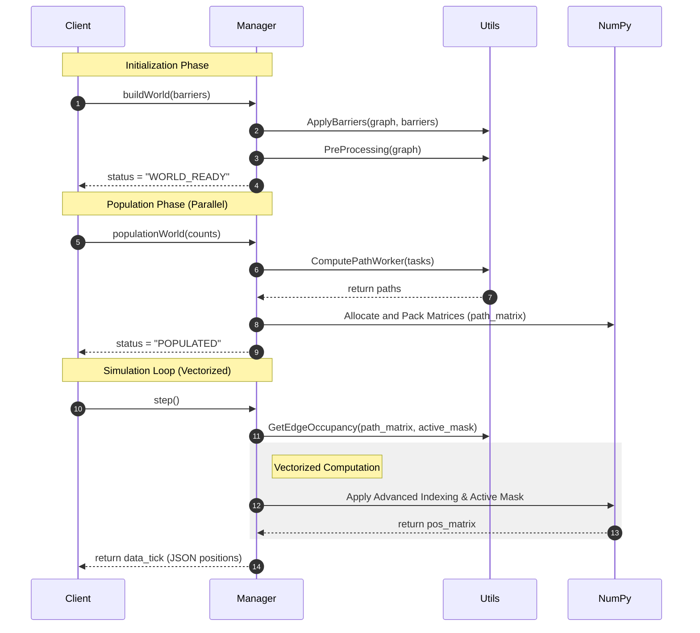
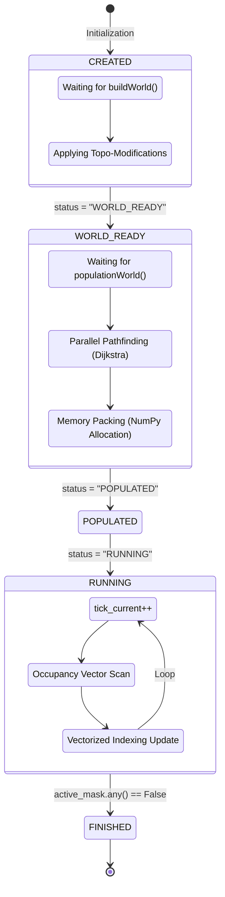

# Core Architecture

## The Shift from OOP to DOD

In the initial phase of the project, each entity was modeled as an instance of an `Agent` class. While conceptually intuitive, this Object-Oriented Programming (OOP) approach introduced unsustainable overhead due to Python's dynamic object management and inherent memory fragmentation. Beyond 75,000 agents, the system became strictly Memory-Bound and CPU-Bound, choked by the sequential `for` loops required to update individual states.

The breakthrough was **Vectorization**. The `Agent` class was entirely deprecated, and the population was transformed into a set of contiguous NumPy tensors and matrices. Each agent is now exclusively identified by an index within these contiguous memory blocks. This Data-Oriented Design (DOD) leverages highly optimized C-based libraries (like NumPy) to execute simultaneous mathematical operations across the entire population, maximizing CPU register efficiency and drastically minimizing cache misses.

To ensure maximum access speed, spatial data is organized into three pre-allocated core structures:

* **`path_matrix`**: The spatial database of the system. It contains the `(lat, lon)` coordinates for every agent `(N)` at every step of their journey `(S)`. By explicitly downcasting the matrix to `float32` rather than the standard `float64`, RAM footprint was effectively halved without sacrificing geographical precision.
* **`pos_matrix`**: Represents the real-time state of the system. At each simulation tick, the engine does not "recalculate" positions; instead, it extracts them from the `path_matrix` using an **Advanced Indexing** operation. Mathematically, displacing 250,000 agents occurs in a single vectorized command:

  pos_matrix = path_matrix[np.arange(N), current_step_idx]

* **`active_mask`**: A dynamic boolean mask that instructs the CPU to compute updates strictly for agents currently in transit, instantly filtering out those who have already reached their destination.

## Graph Pre-computation & Topological Barriers

Before the simulation physically begins, the Manager integrates real-world data via `OSMnx`. Barriers are not treated as mere "obstacles" but as **topological mutations** to the street graph.

If a road is blocked, its corresponding edge is physically removed from the `NetworkX` graph. This ensures that the Dijkstra algorithm is completely blind to the closed street, forcing the generation of realistic, alternative routing.
Furthermore, each graph edge is assigned a physical capacity attribute. During preprocessing, edge weights (traversal costs) are calculated based not only on distance but also on traffic type (vehicular vs. pedestrian) and the time of day, accurately simulating the natural flow propensity toward main arterial roads.

## Parallel Population (Multiprocessing)

Calculating the shortest path (Dijkstra) for hundreds of thousands of Origin-Destination pairs is the most computationally expensive operation. To bypass Python's Global Interpreter Lock (GIL), the simulator employs a **Parallel Population** strategy.

The computational load is distributed across independent worker processes operating in parallel. Each CPU core receives a subset of routing tasks, computes the paths autonomously, and returns raw data that is subsequently packed into the final matrices. This approach ensures near-linear scalability relative to the number of available physical cores.

### Fault Tolerance & Error Handling

When a user deploys a topological barrier (e.g., locking down an entire neighborhood), the `NetworkX` graph mutates. This creates a tangible risk: an agent might be assigned an Origin or Destination point that is no longer connected to the wider city grid.
In a standard approach, Dijkstra would raise a `NodeNotFound` or `NetworkXNoPath` exception, potentially halting the entire population routine.

During the Parallel Population phase, every worker operates within a strict `try-except` block. If a path cannot be resolved, the worker does not crash; it safely returns a null value. The Manager collects only valid results. "Failed" agents are tallied in the `spawn_errors` variable but are never packed into the final NumPy matrices.
This guarantees that once the physical simulation starts, every row in the `path_matrix` contains guaranteed navigable data, eliminating the risk of crashes during the high-speed movement loop.

## API-First Design & Sequence Diagram

The decision to build the engine upon **FastAPI** serves a precise architectural need: decoupling resource management (routing and movement math) from visualization or command logic (the Frontend/Client).
In a system handling massive populations, the computational thread must never be blocked by I/O operations. The API architecture empowers the Manager to:

1. **Operate in the Background:** While the engine processes simulation ticks, the API remains asynchronous and responsive. The user can poll system states (e.g., active agent counts) without interrupting the core math loop.
2. **Control the Lifecycle:** Each simulation phase is strictly isolated. The Client retains full authority over *when* to build the world, *when* to populate it, and *when* to advance time, ensuring perfect synchronization between client logic and server memory.

A major advantage of this approach is data transfer efficiency. Instead of transmitting heavy data structures (like the entire graph or pre-calculated paths), the API acts as a filter. On every `step()` call, the system extracts a lightweight "snapshot" of the `pos_matrix`. Data is serialized into a lean JSON payload containing only the coordinates and IDs required for client rendering. This minimizes network latency, enabling smooth visualization even under extreme population loads.

### API Routing

* **`POST /build` (Initialization):** Receives geographic coordinates and topological barriers. The Manager models the street graph. Until this phase concludes, the graph is considered "unstable," and the system blocks access to subsequent phases.
* **`POST /populate` (Population):** Triggers the massive parallel path calculation. By utilizing `BackgroundTasks`, the endpoint immediately returns control to the Client, preventing HTTP timeouts and allowing for fluid UI monitoring.
* **`GET /step` (Execution):** Triggers a single simulation tick. The Manager slices the `pos_matrix` and returns the current coordinates.

---

## The State Machine

Simulation stability is strictly enforced by a finite state machine that prevents illegal memory operations. Because the system relies on pre-allocated matrices and background parallel computing, each state acts as a validation "checkpoint." It is impossible to advance to the next state if the previous phase has not guaranteed data integrity.

* **`CREATED`:** The Manager is instantiated, but memory is empty. The system listens for configuration parameters. This is the only safe window to define the environment without causing inconsistencies.
* **`WORLD_READY`:** Achieved post-`/build`. The street graph is downloaded, barriers are applied, and traversal weights are calculated. The world is now immutable: sealing the topology ensures subsequent pathfinding does not reference removed roads.
* **`POPULATING`:** A transitional state triggered by `/populate`. The system is locked in background parallel computing (Dijkstra). Execution endpoints (`/step`) are blocked to prevent accessing unallocated memory.
* **`POPULATED`:** Background calculation is complete, and data is packed into NumPy matrices. Population `N` is fixed, and memory is optimized. The system exposes the `spawn_errors` variable; if acceptable, the engine is cleared for physical simulation.
* **`RUNNING`:** The engine is actively executing. Every `/step` call increments the global tick. The system utilizes the `active_mask` to process only necessary indices, maintaining constant computational load.
* **`FINISHED`:** Triggered when `active_mask.any() == False` (all agents arrived or stuck). The Manager freezes final telemetries (e.g., average congestion, total stuck ticks) to allow the Client to pull a definitive static report without risk of data mutation.

